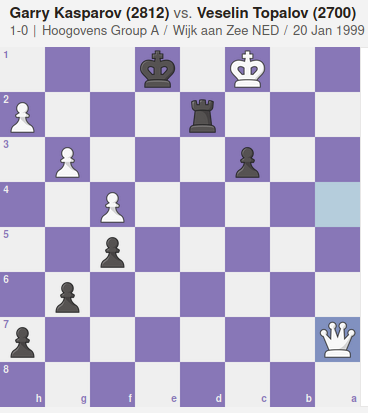

# Immortal

**Category**: Programming \
**Points**: 479

## Discription

> How many pawns are left on the board after the game is completed?
a = number of black pawns left
b = number of white pawns left
Submit the answer as: b00t2root{a,b}

## Solution

We were given [moves](moves) file. Looking into the file, i don't understand what type of data is it. Searching on google gave us this page [Pirc_Defence](https://en.wikipedia.org/wiki/Pirc_Defence). So these are `chess` moves

Scrolling the page gave us `Example Games`. One game moves are same as given in the [moves](moves) file.

So i searched for that particular game on google and got a great [website](https://www.chess.com/blog/SamCopeland/the-greatest-chess-game-of-all-time-explained-kasparov-vs-topalov-1999) that show the whole game in Graphical Format

we need to know the number of white and black pawns left in last

FLAG : b00t2root{4,3}
