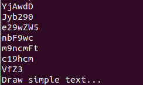
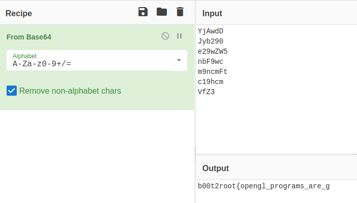

# Open gl

**Category**: Reverse Enginnering \
**Points**: 490

## Solution

We are given a [binary](sample). As always, i ran strings on it. Looking to the output we have some strings

decoding them from `cyberchef` leaks most of the flag

looking at the flag it was obvious the last word is `great`

Flag : `b00t2root{opengl_programs_are_great}`

(This was not the intended solution of this challenge but authors forgot about strings)
