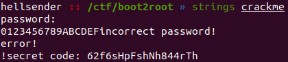

# Staple 

**Category**: Reverse Enginnering \
**Points**: 481

## Discription

> Whats the secret code Note:-Enclose secret code in b00t2root{}

## Solution

So we are given [crackme](crackme) to reverse and get the secret code. First thing i do is, check out the strings

FLAG : `b002root{62f6sHpFshNh844rTh}`

(This was not the intended solution of this challenge but authors forgot about strings)
