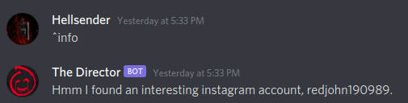

# Target 1

**Category**: OSINT \
**Points**: 100

## Discription

> There is a secret agent deep in enemy territory relaying critical information through clues spread all over the web. Your job, as a hacker at the NSA, is to find the clues about his targets and get the final information which is in the form of flags.
To aid you on this journey, we have found a discord bot (check the main server) which gives you the appropriate flag on sending the name of the next target (All caps with no spaces). If you are stuck, don't hesitate to contact the mastermind of this operation, @rasput1n#8331 on the main server.
The next challenges are continuation of this challenge.
For the first clue, send a message "^info" (without quotes) to the discord bot.
Note: To send messages to the bot, you need to use ^ before every command.

## Solution

As said in discription i messaged the bot `^info`

