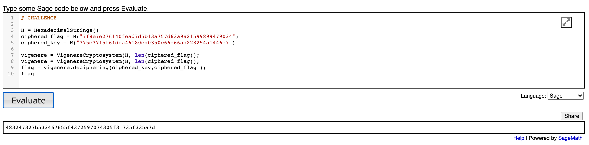
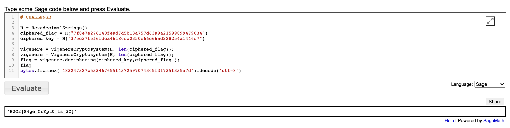

# Crypto Challenge

## La voie du SAGE - 50 points

### Description: 
```French -- Vous souhaitez commencer un entrainement avec le vieux sage du village car vous souhaitez apprendre la voie du SAGE, afin qu'il devienne votre maitre, il vous met au défi de récupérer le flag chiffré en vigenère avec une clé chiffré elle même par un chiffrement ancien et connu.```

```Translation in English -- You want to start training with the old sage of the village because you want to learn the way of the SAGE, so that he becomes your master, he challenges you to recover the encrypted flag in vigenère with a key encrypted itself by an old encryption and known.```

### Given: 
```A website containing ciphered_flag and ciphered_key```

Link --> https://sagecell.sagemath.org/?z=eJxVzj2LwkAUheE-kP8QtEnAYj7vzSAWImIKsVnYdrnO3InBGCUJYv69ilvsdqd4eTjzbFOt9_vtYbdNkzSpslVW8YMC--ZC7dfYN1095EWa-OZ24p7DT2ypflf5DGPJyApBGhGZAgZ7lJrQYgBNjpS0zpXOGXRCm9lf5MzTx9BovcZoI8TgyYAshQ9CW8EAHoCCUqWyhqQx4PFtpMm9qbl7MS_h-3du-uk2XodpGPmSV4us5S7_97golk-WTESx&lang=sage&interacts=eJyLjgUAARUAuQ==

### Objective: 
```To decrypt the "ciphered_flag" using "ciphered_key"```

### What to do: 
```Do some SAGE coding for decryption```

### Tools Required: 
    Nothing

### Solution:
    
    Step: Decrypt using VigenereCryptosystem function -- success
    Code: 
    H = HexadecimalStrings()
    ciphered_flag = H("7f8e7e276140fead7d5b13a757d63a9a21599899479034")
    ciphered_key = H("375c37f5f6fdca46180cd0350e66c66ad228254a1446c7")
    vigenere = VigenereCryptosystem(H, len(ciphered_flag));
    flag = vigenere.deciphering(ciphered_key,ciphered_flag );
    flag
    Output: 483247327b533467655f4372597074305f31735f335a7d // some hex value

    
    Step: Copy the above hex value and decode it -- success
    Code: bytes.fromhex('483247327b533467655f4372597074305f31735f335a7d').decode('utf-8')
    Output: We get the flag

    
### Flag: 
    H2G2{S4ge_CrYpt0_1s_3Z}

### Author Name:
    Mann Pradhan {Ikshvaku}
