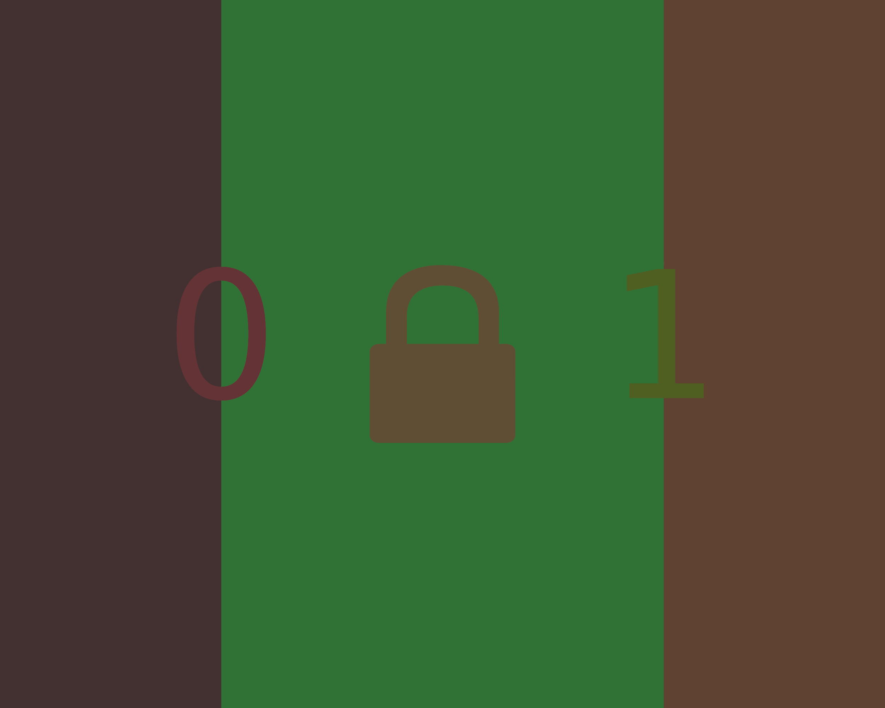
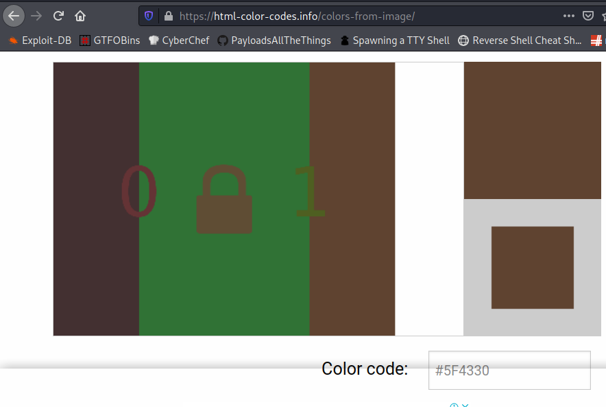
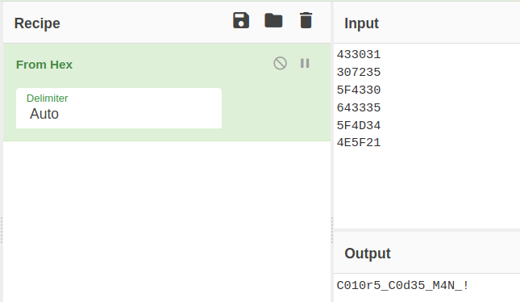

# Cature The Flag

**Category**: Steganography \
**Points**: 10

## Discription

- Left To Right
- Hex

## Challenge

- Given PNG Image
- Get flag

## Solution

We were given a png image



After reading the discription it was clear that solution is related to `Hex`, I though it would be changing the magic numbers of the image. But that did not worked.

So i researched a bit and got a idea, that it could be reading the hex value of colors, for that purpose i got a great website : `https://html-color-codes.info/colors-from-image/`



Decoding all colors hex value from left to right, First background colors then the symbols from left to right gives us

```
433031
307235
5F4330
643335
5F4D34
4E5F21
```

lets convert it to `ASCII` with `Cyberchef`



FLAG : H2G2{C010r5_C0d35_M4N_!}


