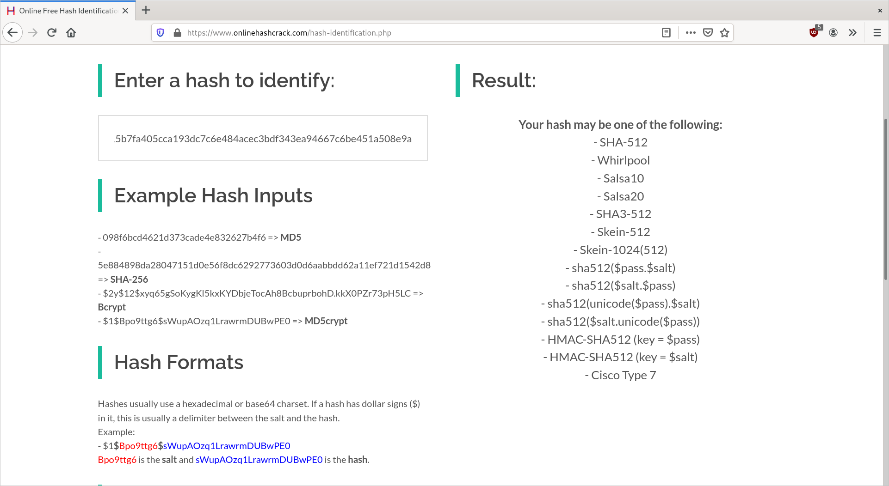

# We Will Rock You
**Category: hash cracking**  
**Points: 20**

## Description
We are given the hash `0a5a0a121c309891420d117b7efc169d78ec233351e2b86b9778df7af3bd8a5e82ab3d3715b7fa405cca193dc7c6e484acec3bdf343ea94667c6be451a508e9a` to crack. The flag is in the format `H2G2{<password>}`.

## Solution
The title of the challenge hints at the rockyou.txt wordlist. Looking at the hash, it has 128 characters. It is most likely  
a SHA-512 or Whirlpool hash. We can use this website https://www.onlinehashcrack.com/hash-identification.php to identify it.



We can then use john the ripper to crack the hash. First I tried john with SHA-512 format.
```
$ john --format=raw-sha512 --wordlist=/usr/share/wordlists/rockyou.txt hash
```
No result. After that I tried whirpool as the format.  
```
$ john --format=whirlpool --wordlist=/usr/share/wordlists/rockyou.txt hash
```
This is the output. We can see the password is ilovejohnny.
```
Proceeding with single, rules:Single
Press 'q' or Ctrl-C to abort, almost any other key for status
Almost done: Processing the remaining buffered candidate passwords, if any.
Proceeding with wordlist:/usr/share/john/password.lst, rules:Wordlist
ilovejohnny      (?)
1g 0:00:00:00 DONE 2/3 (2020-11-30 04:17) 33.33g/s 1092Kp/s 1092Kc/s 1092KC/s chatty..dyesebel
Use the "--show" option to display all of the cracked passwords reliably
Session complete
```
FLAG - `H2G2{ilovejohnny}`
