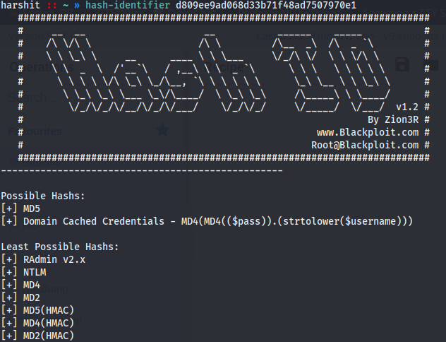
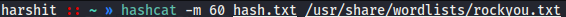
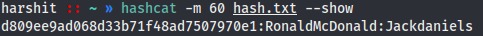

# We Will Rock You Again

**Category**: Hash Cracking \
**Points**: 50

## Challenge

- Given Hash And Salt
- Crack The Hash

## Solution

We were given a hash and salt : `d809ee9ad068d33b71f48ad7507970e1:RonaldMcDonald`

First of all i used Hash-Identifier to identify the hash type

So we are given a `MD5` hash and thier are lots of website and tool that can be used to crack `MD5` hash with salt, but none of them worked.

Hash-Identifier also gives a possibility that it can be a `MD5(HMAC)`, so i looked hashcat for `MD5(HMAC)` 

Now its time to fire up hashcat with `-m 60` as mentioned in hashcat help with `Rockyou.txt` wordlist

And It worked!!!

FLAG : `H2G2{Jackdaniels}`

