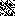
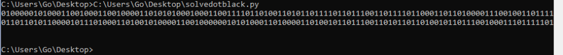

# Black Dots

**Category**: Stego
**Points**: 10


In the given picture. you'll see white & black pixels, after sometime I realized it's pointing to something
I wrote a small script that's convert the white pixel to 0 and the black to 1 , for convert the pixels into binary.
```
from PIL import Image, ImageDraw 
image = Image.open("mg.png")
draw = ImageDraw.Draw(image)
width = image.size[0]
height = image.size[1]
str = ''
pix = image.load()
for x in range(height):
    for y in range(width):
        r = pix[y, x][0]
        g = pix[y, x][1]
        b = pix[y, x][2]
        sr = (r + g + b)
        if sr == 0:
            str += '1'
        else:
            str += '0'
print(str)
```
And we got the binary , using any online converter we can convert the binary into text.



the flag is `AFFCTF{MonochromatiC ThinkinG}`
