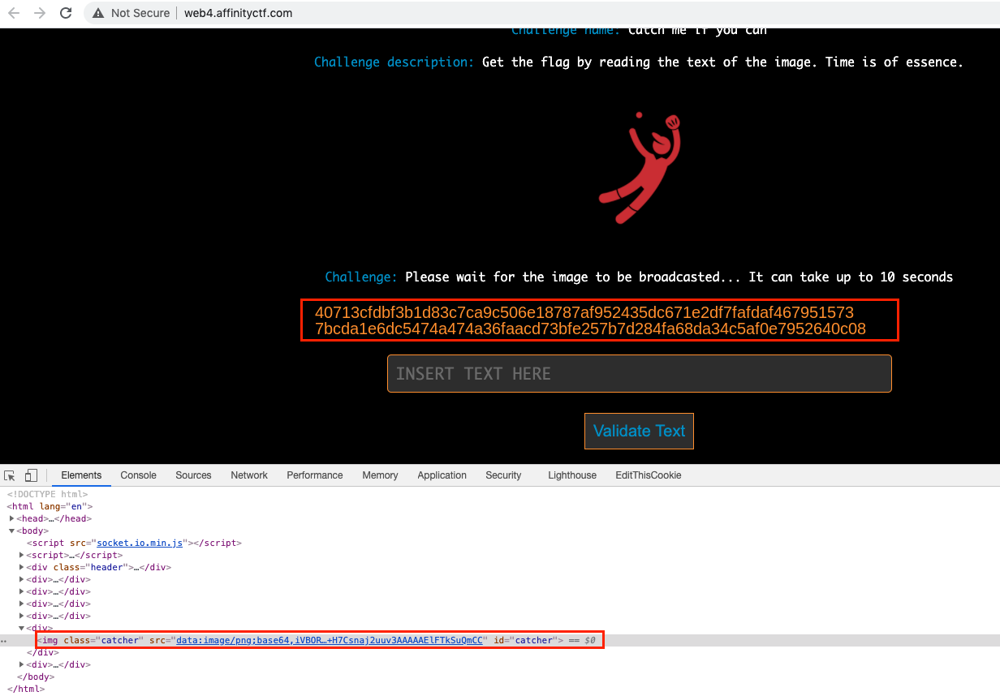
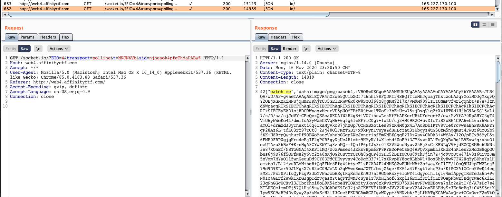
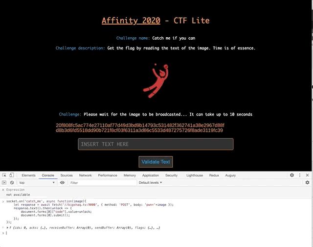

# Catch me if you can
**Category**: Web

**Points**: 300

The task:
>Get the flag by reading the text of the image. Time is of essence



The image is refreshed every 10 seconds, if we're able to copy & paste the characters in less than 10 seconds == we win.

The solution is divided into 2 parts:
* Parsing the image and translating it into text
* Making sure we have the latest image from the server

## Parsing the image

We can download a few sample images and see if common OCR engines (such as tesseract) can actually read the image:

```py
# python3 test.py ./sample-image.png
from PIL import Image
import pytesseract
import sys
imagefile = sys.argv[1]


h = Image.open(imagefile)
unlock = pytesseract.image_to_string(h, lang='eng', config='--psm 10 --osm 3 -c tessedit_char_whitelist=0123456789abcdef' ) 
unlock = ''.join(unlock.strip().split('\n')) 

print(unlock) 
```

This script works (relatively) fine. We're done with parsing. 

Now let's wrap everything into a "RESTful" endpoint on localhost:

```py
import http.server
import socketserver
import re
import pytesseract
from PIL import Image
from http import HTTPStatus
from base64 import b64decode

PORT = 9000
PNG_OUT = "out.png" 

def parse_req(reqbody):
    matches = re.search('data:image/png;base64,(.*)', reqbody.decode('utf-8'))
    return matches.group(1)

def save_png(path, bytestream):
    h = open(path, 'wb')
    h.write(b64decode(bytestream))
    h.close()

def get_text(imagefile):
    h = Image.open(imagefile)
    unlock  = pytesseract.image_to_string(h, lang='eng', config='--psm 10 --osm 3 -c tessedit_char_whitelist=0123456789abcdef')
    unlock  = ''.join(unlock.strip().split('\n')) 
    
    return unlock.encode()


class Handler(http.server.SimpleHTTPRequestHandler):
    def do_POST(self):
        content_length = int(self.headers['Content-Length']) 
        post_data = self.rfile.read(content_length)[4:] # yikes
        b64 = parse_req(post_data)
        save_png(PNG_OUT, b64)
        pwn = get_text(PNG_OUT)

        self.send_response(HTTPStatus.OK)
        self.send_header('Access-Control-Allow-Origin', '*')
        self.end_headers()
        self.wfile.write(pwn)


while True:
    httpd = socketserver.TCPServer(("", PORT), Handler)
    print("serving at port", PORT)
    httpd.serve_forever()


```

We're done cooking our parser endpoint. Now we need to call it at the right timing and with the latest image from the server.

## Catching a fresh image

If you'll look at the HTTP response, you'll see that the page uses long-polling / _Socket.IO_ to fetch the images:
```
<script src="socket.io.min.js"></script>
<script>
    var socket = io();
    socket.on('catch_me', function(image){
        document.getElementById('catcher').src=image;
    });
</script>
```


We can add our own listener that will take the ``catch_me`` messages and forward everything to our local parser endpoint:

```js
socket.on('catch_me', async function(image){
    let response = await fetch('//bigshaq.tv:9000', { method: 'POST', body: 'pwn='+image });
    response.text().then(unlock => {
        document.forms[0]["code"].value=unlock;
        document.forms[0].submit(); // you can also send an XHR request directly to /validate
    });
});

```

Next time the image is refreshed, our listener will be triggered:



got it :D 
```
AFFCTF{Y0uC4ughtM38ySupr1s3!}
```


Thanks for the challenge.