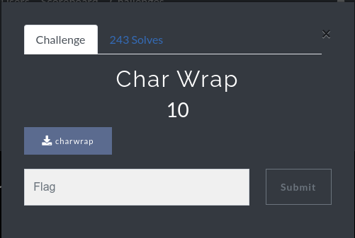
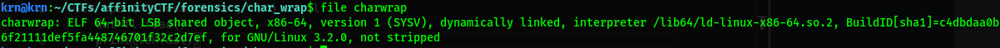

# Writeup: Char Wrap:triangular_flag_on_post:

***Category : Forensic***:minidisc:\
***Points : 10***\
***Author : krn bhargav (Ryn0)*** \
***Team : Red-Knights***:warning:
## Description
>only [file](https://github.com/Red-Knights-CTF/writeups/raw/master/2020/affinity_ctf_lite/Char_Wrap/charwrap) given.
  

  
## solution
>This is only elf-64 file.
  


>use strings to get flag(flag format : AFFCTF{})


>then remove 'H', you got
```
Flag : AFFCTF{you_found_somethiHng!}
```
