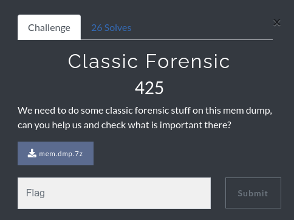
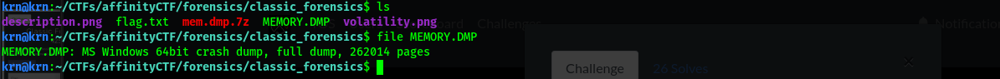
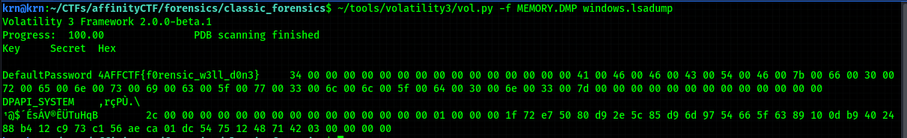

# Writeup: Classic Forensic:triangular_flag_on_post: 

***Category : Forensic***:minidisc:\
***Points : 425***\
***Author : krn bhargav (Ryn0)*** \
***Team : Red-Knights***:warning:
## Description
>We need to do some classic forensic stuff on this mem dump, can you help us and check what is important there?

[Dumpfile](https://2020.affinityctf.com/files/f8289d6b397154b768538dd9213d4589/mem.dmp.7z)-259 MB (sorry for not uploading.)


  
## solution
>We have a MS Windows 64bit crash dump,for this we have to use the tool [Volatility3](https://github.com/volatilityfoundation/volatility3).
>Thanks to the authors for making our life easy.



>During this ctf,I try everything to analyse this MEMORY.dmp but donot find anything ,finally i use this command.

```
vol.py -f MEMORY.dmp windows.lsadump
```
>in this command we used the lsadump plugin to extract lsa secrets.
>and found flag


```
Flag : AFFCTF{f0rensic_w3ll_d0n3}
```
