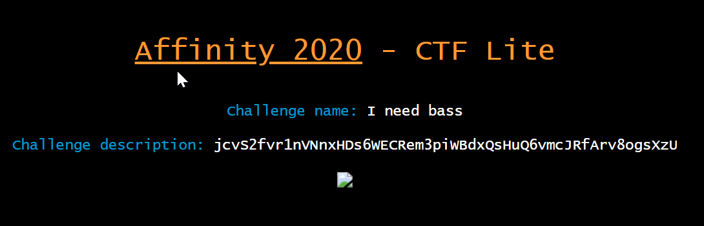

# I need bass 100 points
##### Category : Steganography

I need a bass to earn some bitcoin! http://web5.affinityctf.com/

This is quite a simple challenge as compared to the other Stego challenges :) 
Just needed a good cryptography knowledge...

First go to the above link and you will see something like this....

Now upon observation we can see an encoded string... jcvS2fvr1nVNnxHDs6WECRem3piWBdxQsHuQ6vmcJRfArv8ogsXzU

bass can be related to base encoding... {Bitcoins are encrypted}

So we took the string and fed it to cyberchef console, which detected the type of encryption of the following string...

The String was of Base58 encoding...
