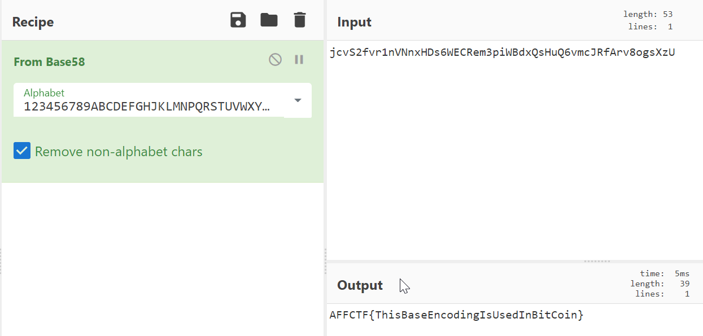

# I need bass {100 points} 🎸

##### Category : Steganography
##### Author : Jerin John Mathew (Shadow_Walker)
##### Team : Red Knights

  

I need a bass to earn some bitcoin! http://web5.affinityctf.com/

This is quite a simple challenge as compared to the other Stego challenges 😄

Only needed a good cryptography knowledge...

First go to the above link and you will see something like this....

Now upon observation we can see an encoded string... jcvS2fvr1nVNnxHDs6WECRem3piWBdxQsHuQ6vmcJRfArv8ogsXzU

bass can be related to base encoding... {_Bitcoins are encrypted_}

So we took the string and fed it to cyberchef console, which detected the type of encryption of the following string...

The String was of **Base58 encoding**...

cipher text : jcvS2fvr1nVNnxHDs6WECRem3piWBdxQsHuQ6vmcJRfArv8ogsXzU

decrypted text : AFFCTF{ThisBaseEncodingIsUsedInBitCoin}

## Flag Obtained :- AFFCTF{ThisBaseEncodingIsUsedInBitCoin} ... 🚩

Check out this article for more information on the topic of _Bitcoins & Base58_ :--> https://en.bitcoin.it/wiki/Base58Check_encoding
