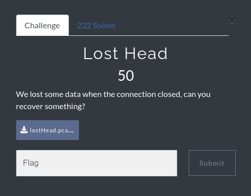
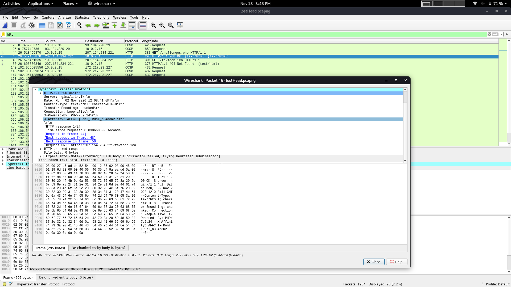

# Writeup: Lost Head:triangular_flag_on_post: 

***Category : Forensic***:minidisc:\
***Points : 50***\
***Author : krn bhargav (Ryn0)*** \
***Team : Red-Knights***:warning:
## Description
>We lost some data when the connection closed, can you recover something?

[file](lostHead.pcapng)


  
## solution
>we have a pcap file ,open it in wireshark,filter the http protocol and check the response from 'GET challenge.php' request

>you got flag in X-Affinity header.
  


```
Flag : AFFCTF{DonT_TRust_h34d3r2}
```
