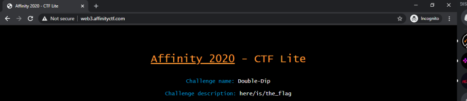
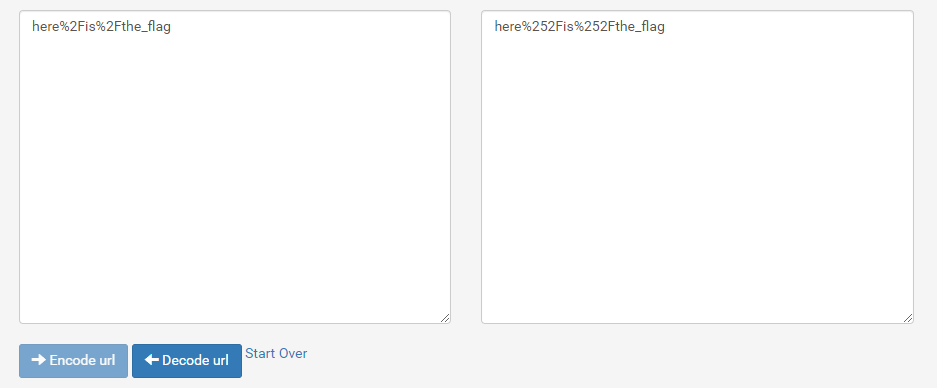
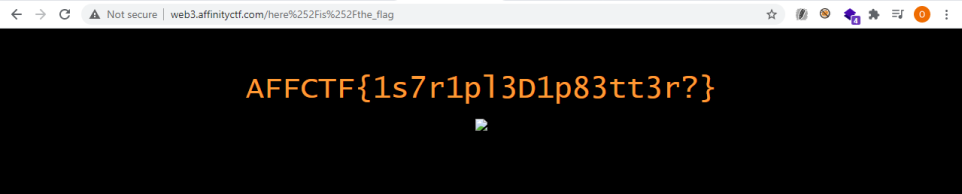

# Path of Double-Dipping

**Category**: Web \
**Points**: 85

Opening the given link: `http://web3.affinityctf.com` gives us the Challange name and description,

Basically From the description you'll see the author gives u a directory.
and You'll see Double word in the Name
first thing to came your mind it's URL DOUBLE "ENCODING" the lost word
i'll use this website for double encoding https://www.url-encode-decode.com/
and encode the given dir twice,
 
and put it into the url like this,and will get the flag.

The flag is `AFFCTF{1s7r1pl3D1p83tt3r?}`
