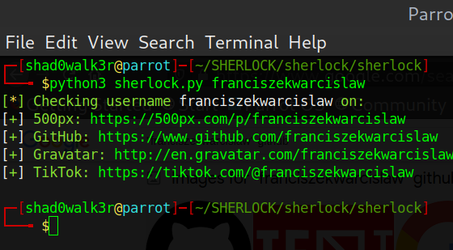
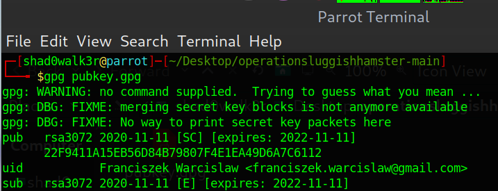
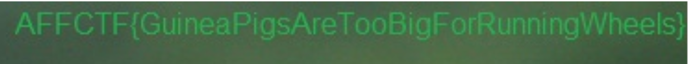
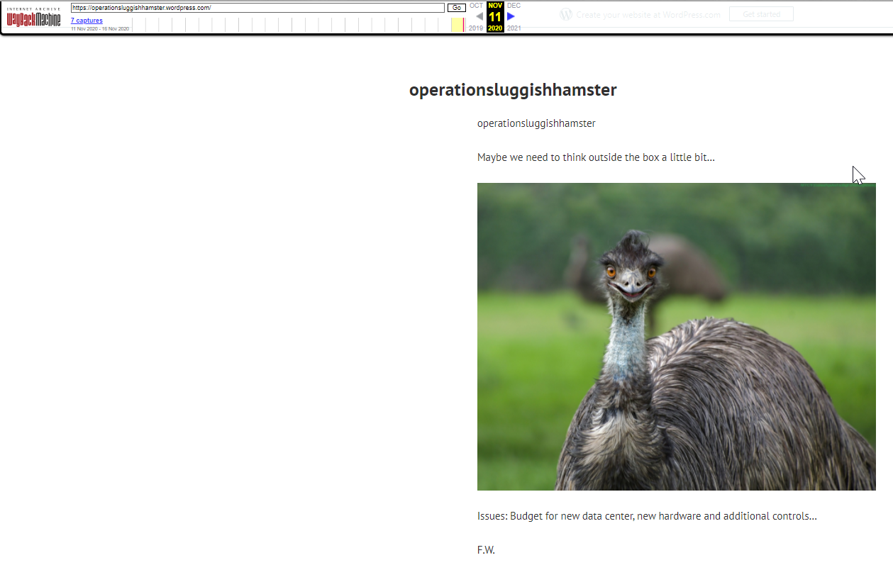

# operationsluggishhamster (229 points) 

## Challenge Description
Hello! There is a problem with an unknown company data center. Their existing solution is not efficient. Unfortunately, ex-main engineer **Franciszek Warcislaw** left the company. 
All they have is his login to internal company systems: _franciszekwarcislaw_ and codename for solution upgrade operation: _operationsluggishhamster_ . Can you help?

###### Catregory : OSINT 
###### Author : Jerin John Mathew (Shadow_Walker)
###### Team : Red Knights

 

Tools Used :- Sherlock , gpg , Wayback Machine , etc

The Challenge begins with the above description , where the username of Franciszek Warscislaw **(franciszekwarcislaw)** catches the eye....

Initial step was to find any accounts under this username using *Sherlock Osint Tool* ....

Here, we are able to see that he has a GitHub account in which he has a respository named *_operationsluggishhamster_*
https://github.com/franciszekwarcislaw/operationsluggishhamster

Inside that there was a file named pubkey.gpg which had a public pgp key and a private pgp key...

Now, save the .gpg file and run in terminal as .... gpg pubkey.gpg

Where we get an Email address of none other than Franciszek Warcislaw i.e franciszek.warcislaw@gmail.com....

Since, he left the company (as the description says) , so I tried mailing him and surprisingly got a REPLY !
It had the much needed pgp message for which the decryption keys are giving in the pubkey.gpg

The message was...
This is my time for vacation! I will be back before 01.01.2021.

Ps. I do not work with hamsters anymore !

-----BEGIN PGP MESSAGE-----

hQGMA2aVem7Pudp2AQwAqacnAzr+8DyjtMN2qeDQO0RcpajT89WFLHl7f14csd+2
Ptp9aRfMNjIwbEnsayrrYXXHXxbUsAEeRq72S+L09OoTur5+S3y6ifkEs7AdhSOD
GLBKRaWyBWccH4cmBJILHN0/Cl+XhozVEdqt+rRf00Skvj20S0Az4pz6FFQueQ3Z
eZPRGLwVR17uVFBkSnYNvxKAZQn/ROEUSEFcp5Yo3ML9xZIkq0c9B1YwAcB1HZ8Y
YAyWwETvPipBu9d0aTESF82DlxTYcw+BItlnUfci3e56JlNTqYsXcEEhUKC6YLPe
s0o3mQrtjxLaQL/+ORDzg0yGEtV49PQyVGpyWNNnQSz5rrYtqtfiu7g4DljA55zR
XfPUnOMkpmFA3Bx91OcKLfTB6WK0LJ+NWvLvSh9XstW1FmpmpCQfd6+3QJXmEBwc
oA38DLHu/fFVSiUJtVpizVcMtkvZDaWjcLjEURN7LAakfJdFn5mUExEYTownmJrG
pTm0NoW/qlGi+mWa8oYG0sBzASsOrZA9zKI7lJBLP/OYotGWBS2We3Q4V4VAd501
G4a9ybo4o71JHxsOqkpi8PK5iEB5QIlBxbXGLNyyTJ7SqgIpSWRRZUdPJp/OXQNC
Ref03Jvx8BViV3zrEOkL/zX1AXL/jVzqz9S0SjnhcOzO4Bv2mxVNaClwcuYNhr3+
PQMYMyKfM0pQg6oID6q8OAPfO16tBZxnWEHgpMPqSRRnch0o0R+baMB+99VfkeRl
yC2eAwNsIHReJ17OwMY96o+O7aNeOvSfw61Xd+D1ZI+C4oUB58yLNecWAwYKIyzl
a0r+Tq5XfmVgAuxSqBMfP4KQbXC6aOvzgDr2cQHItScf7OmG4AAzZXtAG0Cvq3y4
rfOO+fptW/kiv9ZqvL7c0uQ8w3Pf7rRfMa9VvDd3oeZ8I1sFvg==
=NgAr
-----END PGP MESSAGE-----

Now from here you need to decrypt this message with the given keys using a gpg decoder twice with the passphrase : operationsluggishhamster

To verify:-

Result of first decryption:---> 

-----BEGIN PGP MESSAGE-----

jA0ECQMCJI9D9fSwGBf/0pABBlFyGxbW6Op7zinz/GuIzsJaBtKpRD/EQk6LscMY
qJ8OSNYMMZQI8mBB0qBebUDe8adxi7aMgc5cNJ2gREY8ZkuBnuGahmc5z20u1Wc9
VgJhSoMESBd3Fu5eFrPeTTWD+LCSDOcTnpRxhubtM9W6D8rS0Ut5SAPZegA0Sub0
mBm3Kyzw/jmtihdd22OomFg\u003d
\u003dQgOX
-----END PGP MESSAGE-----

Result of second decryption:--->

https://docs.google.com/document/d/1yXSpavYyF4ilTnFhvBSytf6UuMcDUPqQeCecIXCkUCU/edit

So now we got a google docs folder... 

Where the engineer provides his notes on the operation which has 3 photos and the 3rd photo creates suspicion with the line _Maybe we need to think outside the box a little bit…_

I just checked the frame of the image and noticed a text around the top left corner of the screen in green font....

And this was this FLAG.....atlast RELIEF!!!

# FLAG OBTAINED :---> AFFCTF{GuineaPigsAreTooBigForRunningWheels}

Now there was an other way in this challenge...

While OSINTing the name operationsluggishhamster we got a wordpress page related to it...
https://operationsluggishhamster.wordpress.com/

Now we put the link into wayback machine and got a great green dot on nov 11... 

And the fourth screenshot gave the same image as similar to that of the google doc file with the image with flag in it...
https://web.archive.org/web/20201111123922/https://operationsluggishhamster.wordpress.com/

## Overall a great experience of OSINT!!!!!

**P.S Thanks for your patience... 😊**
