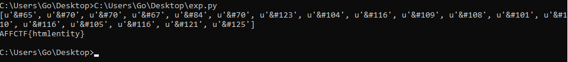

# sooodefault

**Category**: Web \
**Points**: 30

Opening the given link: `http://web2.affinityctf.com/` gives us a Apache2 Ubuntu
Default Page.
If we compare the page with any Apache2 Default page, will notice there HTML
entites. Decoding this will give us the flag but I wrote a quick script for
to collect and decode it :D
```python
import requests
import re
r=requests.session()
url="http://web2.affinityctf.com/"
op=r.get(url)
op=re.findall("&#[0-9]{2,3}",op.text)
print(op)
print(''.join([chr(int(i.replace("&#",""))) for i in op]))
```


The flag is `AFFCTF{htmlentity}`
