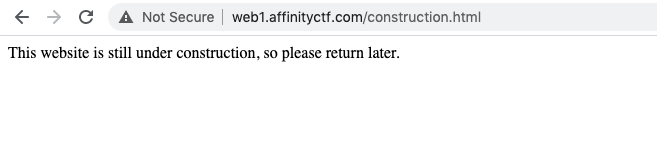
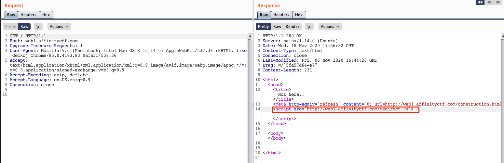
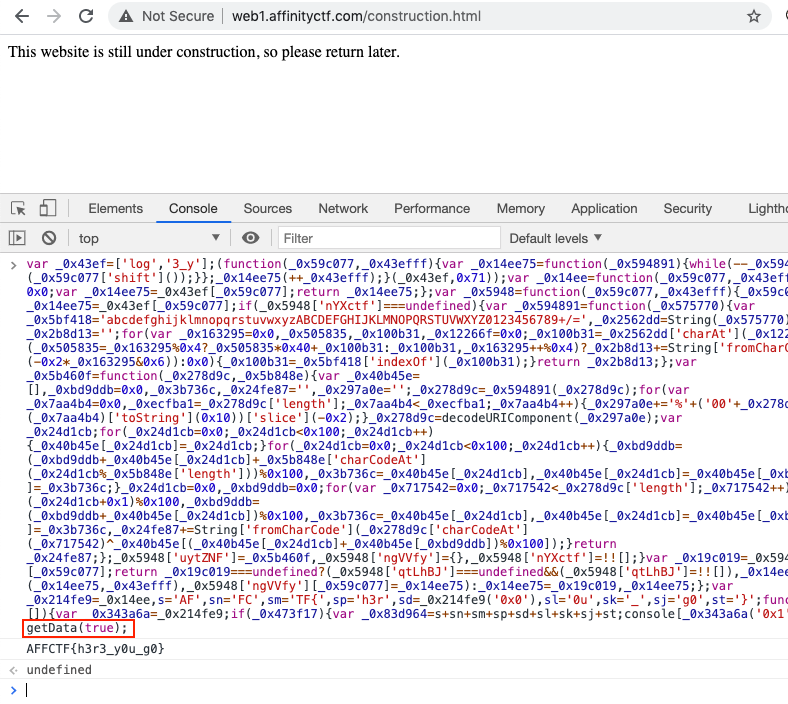

# True Content
The task:
>We are creating a website but for now, there is no much content ready, can you check if there is anything interesting?
>
>URL: http://web1.affinityctf.com/

# Solution

Whenever we're trying to access the URL(http://web1.affinityctf.com/), we are getting redirected to ``/construction.html``:




If we're looking at the 1st response(before we are re-directed) we can see a JS file:



After browsing to the JS file, we'll see a minified (+obfuscated) JS code:

http://web1.affinityctf.com/redirect.js

```javascript
var _0x43ef=['log','3_y'];(function(_0x59c077,_0x43efff){var _0x14ee75=function(_0x594891){while(--_0x594891){_0x59c077['push'](_0x59c077['shift']());}};_0x14ee75(++_0x43efff);}(_0x43ef,0x71));var _0x14ee=function(_0x59c077,_0x43efff){_0x59c077=_0x59c077-0x0;var _0x14ee75=_0x43ef[_0x59c077];return _0x14ee75;};var _0x5948=function(_0x59c077,_0x43efff){_0x59c077=_0x59c077-0x0;var _0x14ee75=_0x43ef[_0x59c077];if(_0x5948['nYXctf']===undefined){var _0x594891=function(_0x575770){var _0x5bf418='abcdefghijklmnopqrstuvwxyzABCDEFGHIJKLMNOPQRSTUVWXYZ0123456789+/=',_0x2562dd=String(_0x575770)['replace'](/=+$/,'');var _0x2b8d13='';for(var _0x163295=0x0,_0x505835,_0x100b31,_0x12266f=0x0;_0x100b31=_0x2562dd['charAt'](_0x12266f++);~_0x100b31&&(_0x505835=_0x163295%0x4?_0x505835*0x40+_0x100b31:_0x100b31,_0x163295++%0x4)?_0x2b8d13+=String['fromCharCode'](0xff&_0x505835>>(-0x2*_0x163295&0x6)):0x0){_0x100b31=_0x5bf418['indexOf'](_0x100b31);}return _0x2b8d13;};var _0x5b460f=function(_0x278d9c,_0x5b848e){var _0x40b45e=[],_0xbd9ddb=0x0,_0x3b736c,_0x24fe87='',_0x297a0e='';_0x278d9c=_0x594891(_0x278d9c);for(var _0x7aa4b4=0x0,_0xecfba1=_0x278d9c['length'];_0x7aa4b4<_0xecfba1;_0x7aa4b4++){_0x297a0e+='%'+('00'+_0x278d9c['charCodeAt'](_0x7aa4b4)['toString'](0x10))['slice'](-0x2);}_0x278d9c=decodeURIComponent(_0x297a0e);var _0x24d1cb;for(_0x24d1cb=0x0;_0x24d1cb<0x100;_0x24d1cb++){_0x40b45e[_0x24d1cb]=_0x24d1cb;}for(_0x24d1cb=0x0;_0x24d1cb<0x100;_0x24d1cb++){_0xbd9ddb=(_0xbd9ddb+_0x40b45e[_0x24d1cb]+_0x5b848e['charCodeAt'](_0x24d1cb%_0x5b848e['length']))%0x100,_0x3b736c=_0x40b45e[_0x24d1cb],_0x40b45e[_0x24d1cb]=_0x40b45e[_0xbd9ddb],_0x40b45e[_0xbd9ddb]=_0x3b736c;}_0x24d1cb=0x0,_0xbd9ddb=0x0;for(var _0x717542=0x0;_0x717542<_0x278d9c['length'];_0x717542++){_0x24d1cb=(_0x24d1cb+0x1)%0x100,_0xbd9ddb=(_0xbd9ddb+_0x40b45e[_0x24d1cb])%0x100,_0x3b736c=_0x40b45e[_0x24d1cb],_0x40b45e[_0x24d1cb]=_0x40b45e[_0xbd9ddb],_0x40b45e[_0xbd9ddb]=_0x3b736c,_0x24fe87+=String['fromCharCode'](_0x278d9c['charCodeAt'](_0x717542)^_0x40b45e[(_0x40b45e[_0x24d1cb]+_0x40b45e[_0xbd9ddb])%0x100]);}return _0x24fe87;};_0x5948['uytZNF']=_0x5b460f,_0x5948['ngVVfy']={},_0x5948['nYXctf']=!![];}var _0x19c019=_0x5948['ngVVfy'][_0x59c077];return _0x19c019===undefined?(_0x5948['qtLhBJ']===undefined&&(_0x5948['qtLhBJ']=!![]),_0x14ee75=_0x5948['uytZNF'](_0x14ee75,_0x43efff),_0x5948['ngVVfy'][_0x59c077]=_0x14ee75):_0x14ee75=_0x19c019,_0x14ee75;};var _0x214fe9=_0x14ee,s='AF',sn='FC',sm='TF{',sp='h3r',sd=_0x214fe9('0x0'),sl='0u',sk='_',sj='g0',st='}';function getData(_0x473f17=!![]){var _0x343a6a=_0x214fe9;if(_0x473f17){var _0x83d964=s+sn+sm+sp+sd+sl+sk+sj+st;console[_0x343a6a('0x1')](_0x83d964);}}getData(false);
```

we can beautify the code with [beautifier.io](https://beautifier.io/):

```javascript
(function(_0x59c077, _0x43efff) {
    var _0x14ee75 = function(_0x594891) {
        while (--_0x594891) {
            _0x59c077['push'](_0x59c077['shift']());
        }
    };
    _0x14ee75(++_0x43efff);
}(_0x43ef, 0x71));
var _0x14ee = function(_0x59c077, _0x43efff) {
    _0x59c077 = _0x59c077 - 0x0;
    var _0x14ee75 = _0x43ef[_0x59c077];
    return _0x14ee75;
};
var _0x5948 = function(_0x59c077, _0x43efff) {
    _0x59c077 = _0x59c077 - 0x0;
    var _0x14ee75 = _0x43ef[_0x59c077];
    if (_0x5948['nYXctf'] === undefined) {
        var _0x594891 = function(_0x575770) {
            var _0x5bf418 = 'abcdefghijklmnopqrstuvwxyzABCDEFGHIJKLMNOPQRSTUVWXYZ0123456789+/=',
                _0x2562dd = String(_0x575770)['replace'](/=+$/, '');
            var _0x2b8d13 = '';
            for (var _0x163295 = 0x0, _0x505835, _0x100b31, _0x12266f = 0x0; _0x100b31 = _0x2562dd['charAt'](_0x12266f++); ~_0x100b31 && (_0x505835 = _0x163295 % 0x4 ? _0x505835 * 0x40 + _0x100b31 : _0x100b31, _0x163295++ % 0x4) ? _0x2b8d13 += String['fromCharCode'](0xff & _0x505835 >> (-0x2 * _0x163295 & 0x6)) : 0x0) {
                _0x100b31 = _0x5bf418['indexOf'](_0x100b31);
            }
            return _0x2b8d13;
        };
        var _0x5b460f = function(_0x278d9c, _0x5b848e) {
            var _0x40b45e = [],
                _0xbd9ddb = 0x0,
                _0x3b736c, _0x24fe87 = '',
                _0x297a0e = '';
            _0x278d9c = _0x594891(_0x278d9c);
            for (var _0x7aa4b4 = 0x0, _0xecfba1 = _0x278d9c['length']; _0x7aa4b4 < _0xecfba1; _0x7aa4b4++) {
                _0x297a0e += '%' + ('00' + _0x278d9c['charCodeAt'](_0x7aa4b4)['toString'](0x10))['slice'](-0x2);
            }
            _0x278d9c = decodeURIComponent(_0x297a0e);
            var _0x24d1cb;
            for (_0x24d1cb = 0x0; _0x24d1cb < 0x100; _0x24d1cb++) {
                _0x40b45e[_0x24d1cb] = _0x24d1cb;
            }
            for (_0x24d1cb = 0x0; _0x24d1cb < 0x100; _0x24d1cb++) {
                _0xbd9ddb = (_0xbd9ddb + _0x40b45e[_0x24d1cb] + _0x5b848e['charCodeAt'](_0x24d1cb % _0x5b848e['length'])) % 0x100, _0x3b736c = _0x40b45e[_0x24d1cb], _0x40b45e[_0x24d1cb] = _0x40b45e[_0xbd9ddb], _0x40b45e[_0xbd9ddb] = _0x3b736c;
            }
            _0x24d1cb = 0x0, _0xbd9ddb = 0x0;
            for (var _0x717542 = 0x0; _0x717542 < _0x278d9c['length']; _0x717542++) {
                _0x24d1cb = (_0x24d1cb + 0x1) % 0x100, _0xbd9ddb = (_0xbd9ddb + _0x40b45e[_0x24d1cb]) % 0x100, _0x3b736c = _0x40b45e[_0x24d1cb], _0x40b45e[_0x24d1cb] = _0x40b45e[_0xbd9ddb], _0x40b45e[_0xbd9ddb] = _0x3b736c, _0x24fe87 += String['fromCharCode'](_0x278d9c['charCodeAt'](_0x717542) ^ _0x40b45e[(_0x40b45e[_0x24d1cb] + _0x40b45e[_0xbd9ddb]) % 0x100]);
            }
            return _0x24fe87;
        };
        _0x5948['uytZNF'] = _0x5b460f, _0x5948['ngVVfy'] = {}, _0x5948['nYXctf'] = !![];
    }
    var _0x19c019 = _0x5948['ngVVfy'][_0x59c077];
    return _0x19c019 === undefined ? (_0x5948['qtLhBJ'] === undefined && (_0x5948['qtLhBJ'] = !![]), _0x14ee75 = _0x5948['uytZNF'](_0x14ee75, _0x43efff), _0x5948['ngVVfy'][_0x59c077] = _0x14ee75) : _0x14ee75 = _0x19c019, _0x14ee75;
};
var _0x214fe9 = _0x14ee,
    s = 'AF',
    sn = 'FC',
    sm = 'TF{',
    sp = 'h3r',
    sd = _0x214fe9('0x0'),
    sl = '0u',
    sk = '_',
    sj = 'g0',
    st = '}';

function getData(_0x473f17 = !![]) {
    var _0x343a6a = _0x214fe9;
    if (_0x473f17) {
        var _0x83d964 = s + sn + sm + sp + sd + sl + sk + sj + st;
        console[_0x343a6a('0x1')](_0x83d964);
    }
}
getData(false);
```

That's better :D (well, not quite. more specifically: less worse)

At this point, this part caught my eye (which looks like a flag):

```javascript
var _0x214fe9 = _0x14ee,
    s = 'AF',
    sn = 'FC',
    sm = 'TF{',
    sp = 'h3r',
    sd = _0x214fe9('0x0'),
    sl = '0u',
    sk = '_',
    sj = 'g0',
    st = '}';
```

I started looking for cross-references of those variables to get more background on how they are used in the code. I quickly realized that the ``getData`` function is responsible for printing the flag (due to the string concatinations: ``s + sn + sm + sp + sd + sl + sk + sj + st;``):

```javascript
function getData(_0x473f17 = !![]) {
    var _0x343a6a = _0x214fe9;
    if (_0x473f17) {
        var _0x83d964 = s + sn + sm + sp + sd + sl + sk + sj + st;
        console[_0x343a6a('0x1')](_0x83d964);
    }
}
```

To print the flag all we need is to make the ``if (_0x473f17)`` statement in the function to be true. 

In other words, just type in the console:

```javascript
getData(true);
```



We got the flag:

```
AFFCTF{h3r3_y0u_g0}
```

Thanks for the challenge