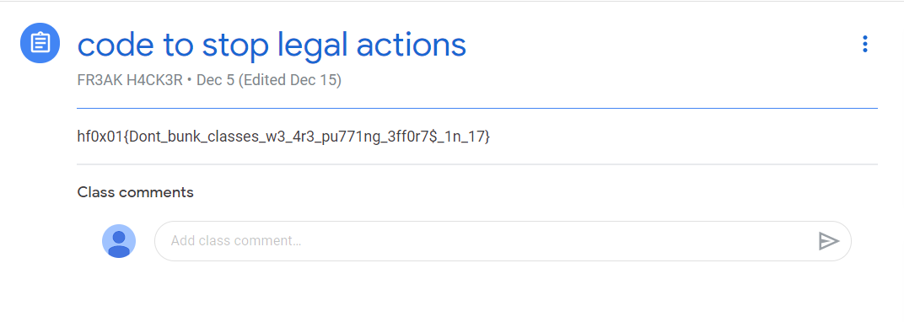

# Class Bunk Case
**category: OSINT**  
**points: 200**

## Description
> Because of COVID pandemic my school is doing classes online.
> But I bunked all my classes and know I get warning from my teacher for that 
> And when I asked him for notes he send me the link. Will you help me to come out of this case.
> Link : https://docs.google.com/document/d/18J2GYPekm4WX6CiuPSF4L8U6sRoDeWAz1QeNh9pbrNc/edit?usp=sharing
## Solution
After going to the link we get a note. In the note the word **past** is bolded a couple of times so following the conventional method of solving OSINT challenge, we go to wayback machine. We type the url of the file and we get one screen shot. After looking the screen shot we observed that a new string was added ***74unfgw***. It looked like a code to us so by common sense and keeping in mind the question. 
We tried it on couple of sites and fortunately it worked on google classrooms
 

FLAG : `hf0x01{Dont_bunk_classes_w3_4r3_pu771ng_3ff0r7$_1n_17}`
