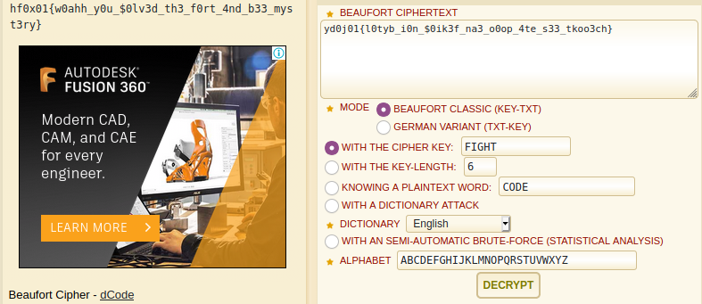

# Fort Mystery
**category: Cryptography**  
**points: 120**

## Description
> Once a wise man said
> Don't compare the people on the basis of size what you compare between a bee and a fort, You have to fight if you want anything in your life there is no comparison 
> You have to fight for your dreams and your goals for everything :)
## Solution
We are provided with a cipher text `yd0j01{l0tyb_i0n_$0ik3f_na3_o0op_4te_s33_tkoo3ch}`. The challenge name looks suspicious so i googled cipher related to it. When i searched for `fort cipher` the first that appeared was `Beaufort Cipher`

So lets decode this on https://www.dcode.fr/beaufort-cipher. This cipher requires key to solve so i looked up for some words in discription and `fight` works for me

FLAG : `hf0x01{w0ahh_y0u_$0lv3d_th3_f0rt_4nd_b33_myst3ry}`
