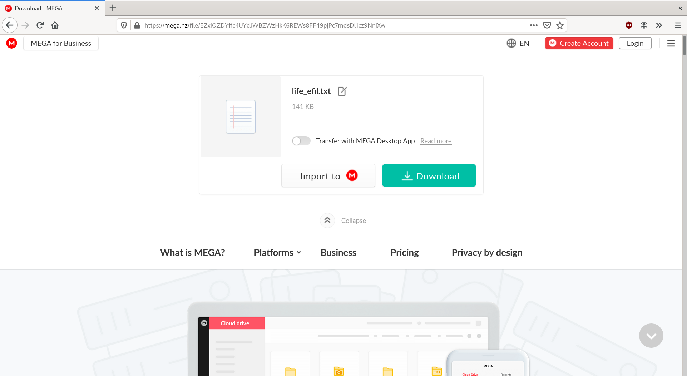

# Mega Sale
**category: forensics**  
**points: 160**

## Description
I was Planning to Organize a Mega Sale but when i try to Access my files i am not getting my files back i tried to entering the file location but not getting my file

"file/EZxiQZDY#c4UYdJWBZWzHkK6REWs8FF49pjPc7mdsDl1cz9NnjXw " can you please help me out to get the file

## Solution
From the title, we can deduce that the text in the description is a link to a file in Mega.nz.
 

After downloading the file, I check its contents. The first line says `Sometimes we need life but we get efil same goes with you`. Following that is a really long string that looks like hex. Decoding it outputs gibberish.
```
$ tail -n 1 life_efil.txt | xxd -r -p
APAPEm0P[%NHN@¦̍W#N窤K[?=D]g?6hf$"~_nAd3lkbrQ)%d9ɜOzwP&.I~k)u3oRFҳ^)[oF)ƫ>9aK6HS-Ot8*m=4Z}~+@yw|)6qwMlQ+(%BƮ~@rG |sRh-?Hlޢ7&PuFM>LTs                                         
                                                                                                                                   {AP2C<ߔr0i!vS8)                          
                                                                                                                                                  p"!7Z`ɧxi(*5|rEP/ba{qt4CH?
                                                                                                                                                  wUBW!W|赿/#q_ʩIτT:&})`"})]"]
...
```

The file name suggests reversing, so I tried reversing the hex string before decoding it. Heres the output.
```
$ tail -n 1 life_efil.txt | rev | xxd -r -p
JFIFC
...
```

This looks like a JPG header. After saving the output to a file, we get the flag.


**FLAG:** `hf0x01{w3lc0me_t0_w4lk3r5_up5id3_d0wn_w0rld_n0w_y0u_g0t_th3_lif3}`

