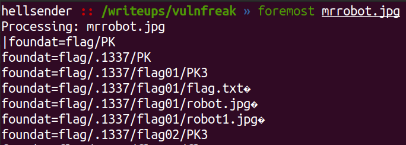
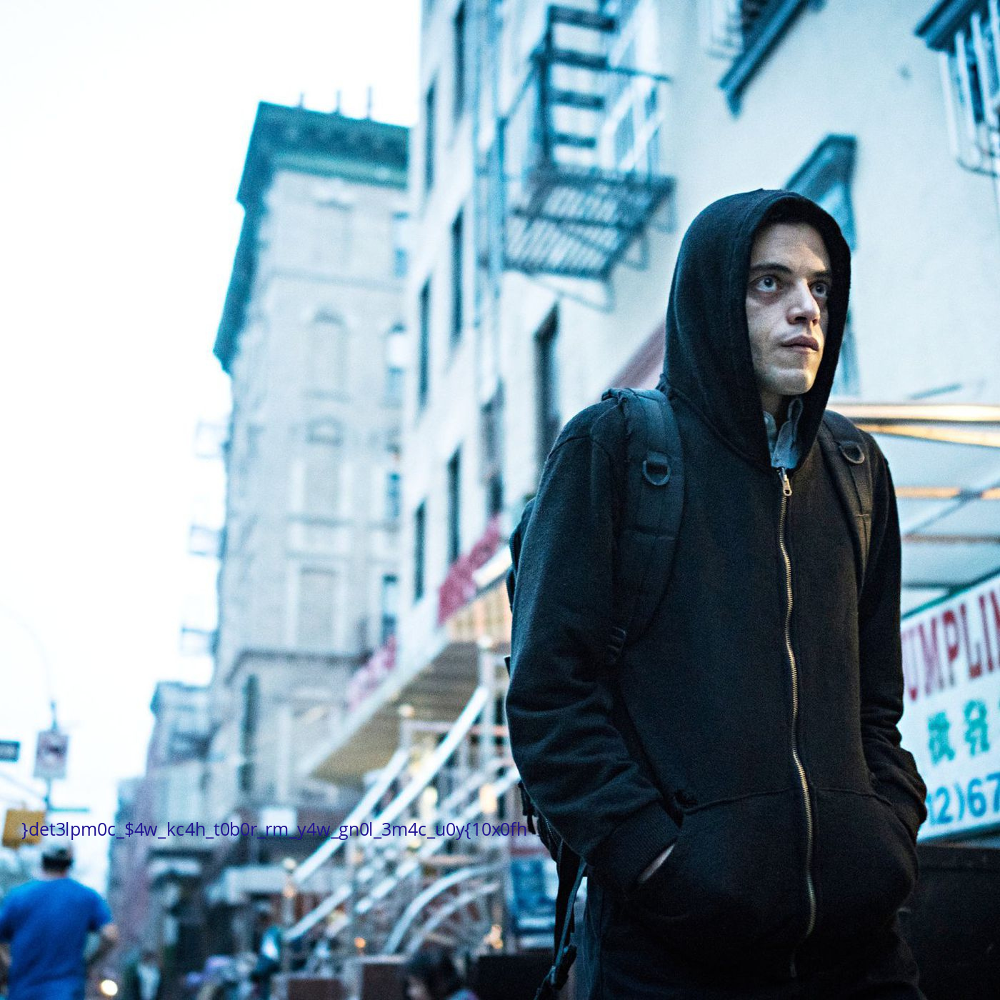

# Mr Robot
**category: Forensics**  
**points: 100**

## Description
> Elliot : By tonight i am gonna start my hack against E-Corp , after that no more the top 1% of the top 1% no one plays god without permission, nobody gonna control us

> Darlene : f0xscy help you when you needed

> Elliot : ok i have to go , prepare for attack

## Solution
We are provided with [jpg](mrrobot.jpg) file and size of the file was `19mb` which is too much for just a image. So it was a clear indication that other files are hinding in this file so i used `steghide`,`binwalk`,`foremost` and foremost seems to work for this challenge.

we got a image and one zip file. There was nothing in the image so i turned to zip file and it was password protected and i remember the discription saying we need this`f0xscy` and it was the password for the zip. 

So now we have two folder, one with many flag.txt files and other one was hidden with having 3 folder in it. All flag.txt file were blank so we are left with 6 images. 3 images were correct and other 3 images have thier headers replaced. Correcting the headers of second image gave us the flag written on the image

FLAG : `hf0x01{y0u_c4m3_l0ng_w4y_mr_r0b0t_h4ck_w4$_c0mpl3ted}`
