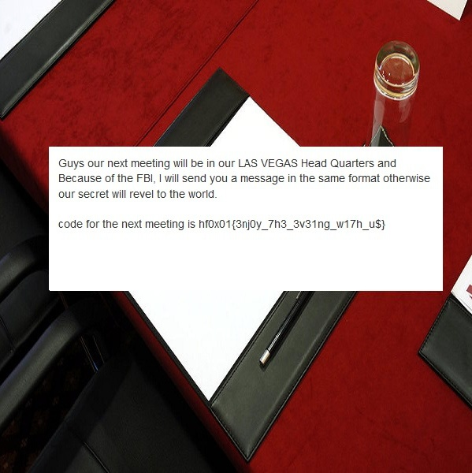

# Note on desk
**category: forensics**  
**points: 200**

## Description
Our team get information that one hacker group is going to orgainze a meeting and they are planning which can be threat to the nation. So when we raided the house of one on the member of that hacker group we get lot's of pieces of paper on the desk. can you help us to find what is that message

## Solution
We get a zip file from the challenge. Inside it is 599 JPGs each with a dimension of 1x600. Here's a python script to concatenate all the images together. The cv2 module can be installed with `pip install opencv-python`.
```python
import cv2

images = [cv2.imread('robot-{}.jpg'.format(i)) for i in range(1, 600)]
result = cv2.hconcat(images)
cv2.imwrite('out.jpg', result)
```
Here we can see the flag inside the image.


**FLAG:** `hf0x01{3nj0y_7h3_3v3ing_w17h_u$}`

