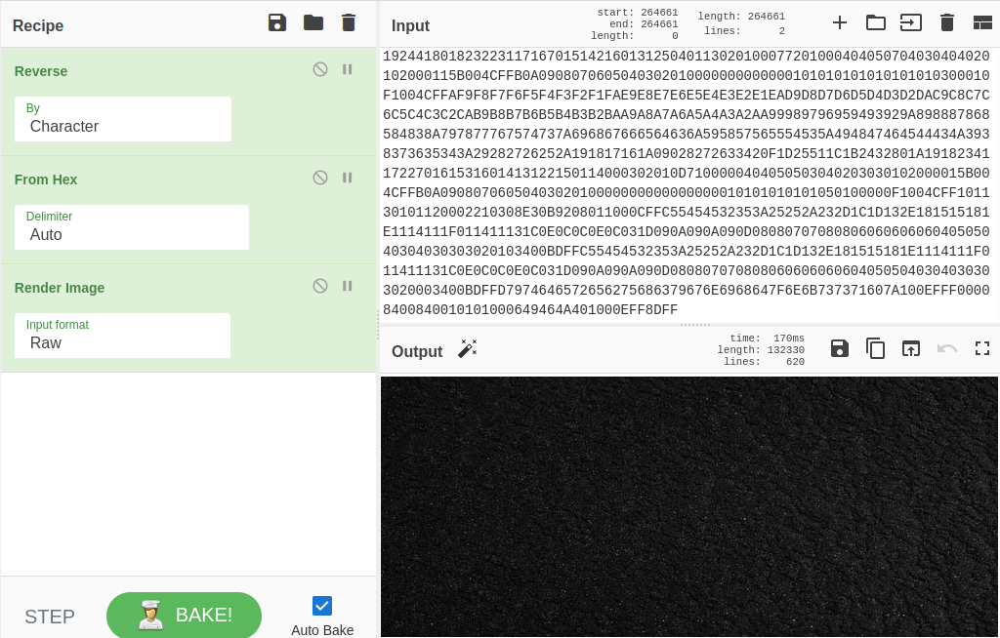

# Easy!!!

**Category**: Misc \
**Points**: 120

## Discription

> A piece of cake for you : )

## Solution

We are given `uggcfzrtnamsvyrJLxJ2LMn#0GK1Iy9IWOfAsRCneIh0MOrNTugF8knPAO-nKX2xE7H` text. I tried some basic things and rot13 worked out

so we got a `mega.nz` link, i went over to the link and we got [file.txt](file.txt). Looking to file.txt content we know that it is hex encoded but decoding with hex was not working on it. so one of our team mate adviced to reverse the content and it worked out. then i decoded it with hex and we got an image.

We got a [jpeg file](index.jpeg). Without any doubt  i ran steghide on that image and we got [flag.txt](flag.txt)

FLAG : `cybergrabs{fin4lly_y0u_g07_th3_fl4g_nic3_buddy}`
