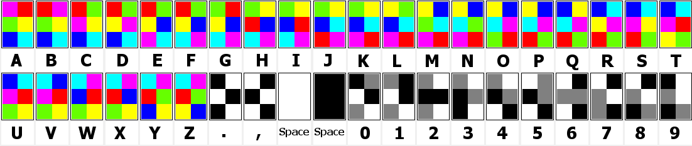

# Wonderful Colours

**Category**: Misc \
**Points**: 150

## Discription

> I love wonderful Colours.

## Solution

We are given a [png](colourfull.png) file. Looking to it we can see, it has boxes with 6 colors in each box. it is `hexahue code`

Decode the challenge picture with this table and you will get the flag

you can get more information about `hexahue code` on https://www.boxentriq.com/code-breaking/hexahue

FLAG : `cybergrabs{w3h4ck3d1t}`

