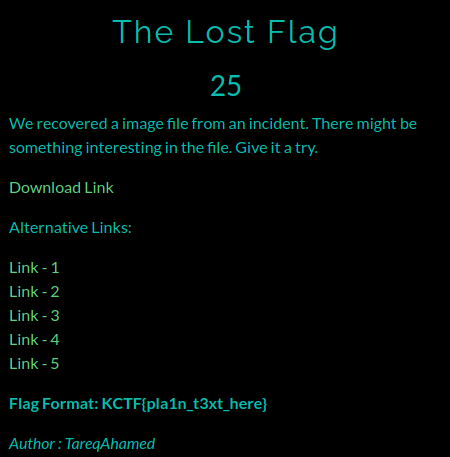
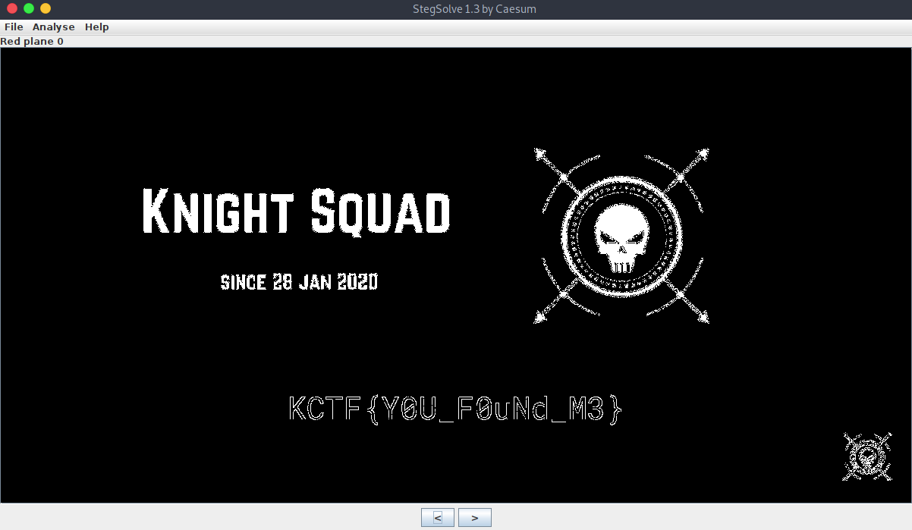

# The Lost Flag

**Category**: Digital Forensic \
**Points**: 25

## Description

> We recovered a image file from an incident. There might be something interesting in the file. Give it a try.

## Solution

Given file is [Lost Flag.png](Lost Flag.png).

Just use `stegsolve` and see the Red plane 0.

# Flag is `KCTF{Y0U_F0uNd_M3}`

