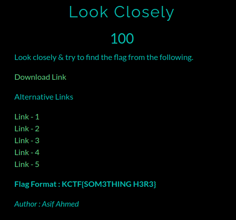
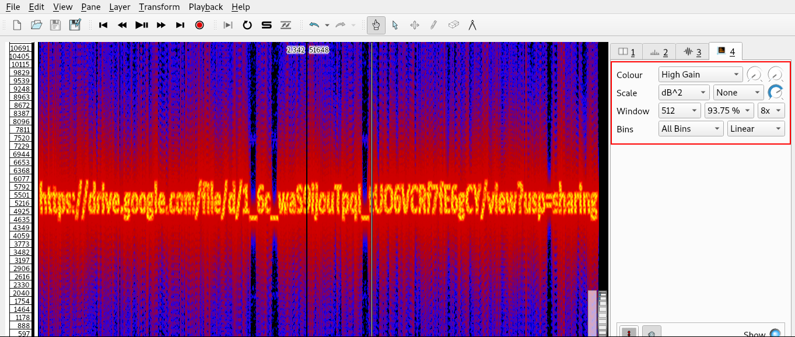

# Look Closely

**Category**: Misc \
**Points**: 100

## Description

> Look closely & try to find the flag from the following.

## Solution

Given file is [look closely.wav](look%20clodely.wav).

Open the wav file using Sonic Visualiser

In Layer add Spectogram or press `Shift + G` and you'll see a url but its not readable.

Use the settings shown below and the link will be readable.

Got https://drive.google.com/file/d/1_6c_waS9ijouTpqI_tUO6VCRf7fE6gCY/view

In the link I got Watch closely.mp4

I watched the video carefully and got two binary code.\
First in [00:10 sec](1.png) and Secound in [00:52 sec](2.png)

Combine the both binary codes and got `0100101101000011010101000100011001111011010010000011001101001100010011000100111101011111010010100011001101001100010011000100111101111101`

[Now, just decode it and got the flag.](https://gchq.github.io/CyberChef/#recipe=From_Binary('Space',8)&input=MDEwMDEwMTEwMTAwMDAxMTAxMDEwMTAwMDEwMDAxMTAwMTExMTAxMTAxMDAxMDAwMDAxMTAwMTEwMTAwMTEwMDAxMDAxMTAwMDEwMDExMTEwMTAxMTExMTAxMDAxMDEwMDAxMTAwMTEwMTAwMTEwMDAxMDAxMTAwMDEwMDExMTEwMTExMTEwMQ)
# Flag is `KCTF{H3LLO_J3LLO}`

