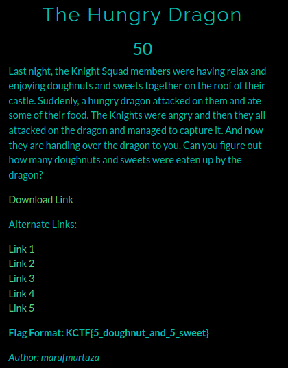
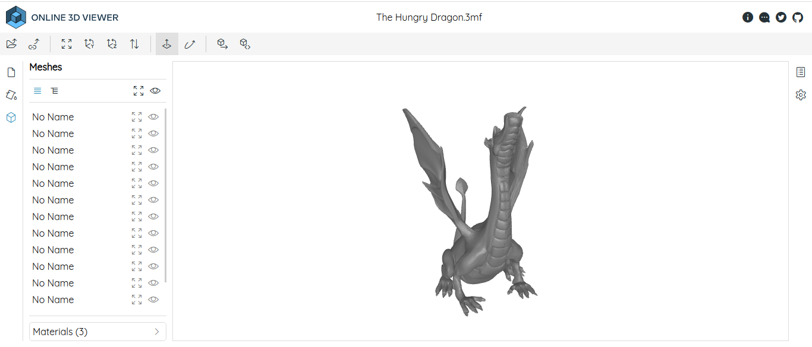
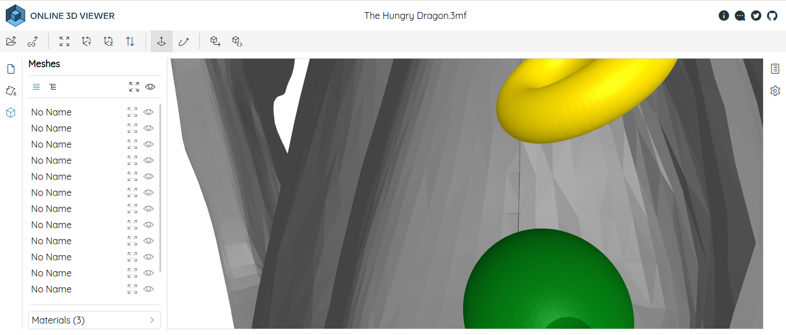
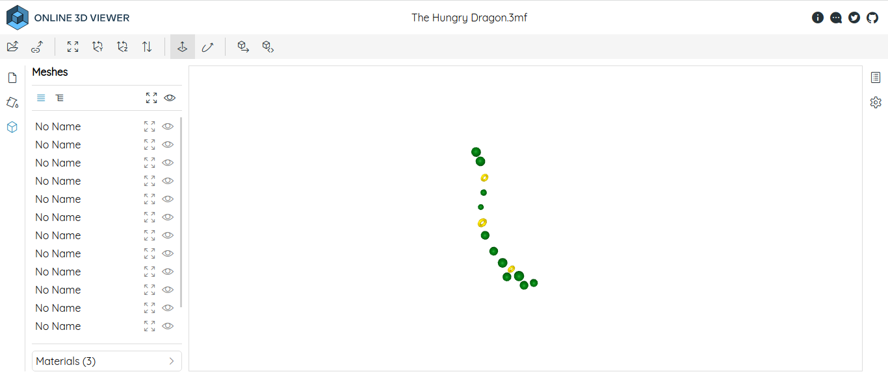

# The Hungry Dragon

**Category**: Misc \
**Points**: 50

## Description

> Last night, the Knight Squad members were having relax and enjoying doughnuts and sweets together on the roof of their castle. Suddenly, a hungry dragon attacked on them and ate some of their food. The Knights were angry and then they all attacked on the dragon and managed to capture it. And now they are handing over the dragon to you. Can you figure out how many doughnuts and sweets were eaten up by the dragon?

## Solution

Given file is [The Hungry Dragon.3mf](The%20Hungry%20Dragon.3mf).

I searched about `.3mf` file and I got that It's a 3D model.

Open the 3d model with https://3dviewer.net/

I zoomed inside the dragon and here I can see the eaten doughnuts and sweets.

Now, zoom-out and right-click on dragon and click on hide mesh now You can see all the eaten doughnuts and sweets.

# Flag is `KCTF{3_doughnut_and_11_sweet}`

