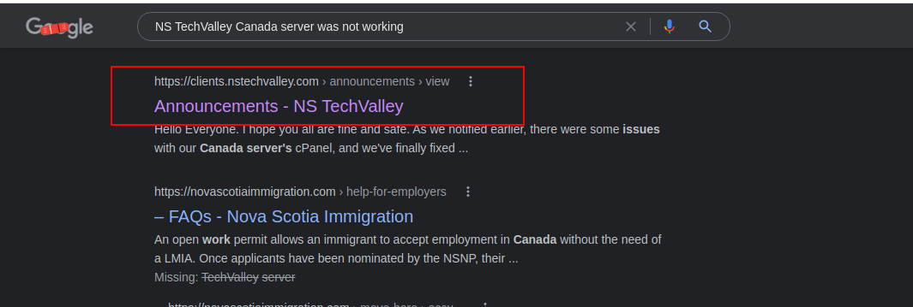
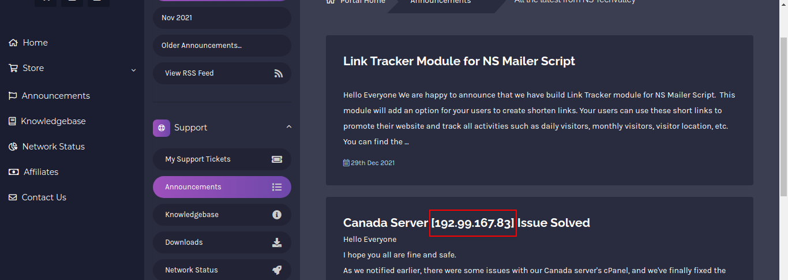

# Canada Server

**Category**: OSINT \
**Points**: 50

## Description

> Our sponsor NS TechValley had some problems last year. Their Canada server was not working as expected. Can you find the IP address of that server?

## Solution

Just google `NS TechValley Canada server was not working `

# Flag is `KCTF{192.99.167.83}`

