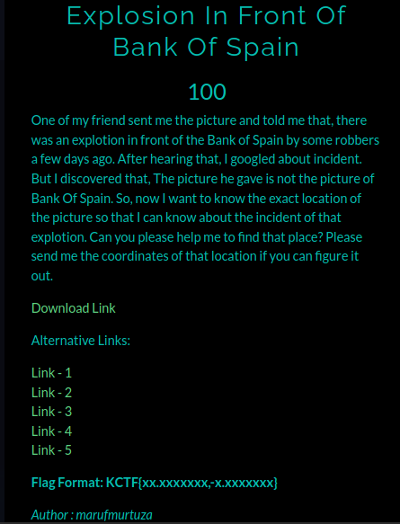
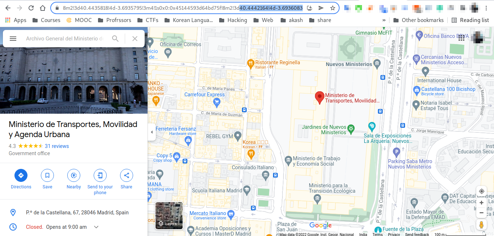

# Canada Server

**Category**: OSINT \
**Points**: 100

## Description

> One of my friend sent me the picture and told me that, there was an explotion in front of the Bank of Spain by some robbers a few days ago. After hearing that, I googled about incident. But I discovered that, The picture he gave is not the picture of Bank Of Spain. So, now I want to know the exact location of the picture so that I can know about the incident of that explotion. Can you please help me to find that place? Please send me the coordinates of that location if you can figure it out.

## Solution
Given file is [Explosion_In_Front_Of_Bank_Of_Spain.png](Explosion_In_Front_Of_Bank_Of_Spain.png)

Just google `money heist bank of spain location`

Got a [result](https://www.klook.com/en-IN/blog/money-heist-film-locations/#:~:text=Rio%E2%80%99s%20illegal%20detention.-,5.%20Ministerio%20de%20Fomento%20(Ministry%20of%20Public%20Works%20and%20Transport)%20as%20the%20Bank%20of%20Spain,-Also%2C%20the%20team)

The real name is `Ministerio de Transportes, Movilidad y Agenda Urbana`.

search it on google map.

The correct coordinates is in end of the google map url.

# Flag is `KCTF{40.4442164,-3.6936083}`

