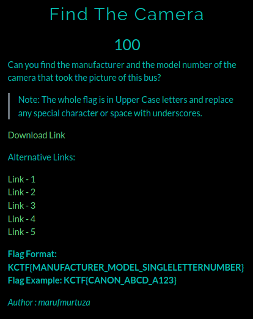
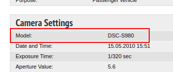

# Find The Camera

**Category**: OSINT \
**Points**: 100

## Description

> Can you find the manufacturer and the model number of the camera that took the picture of this bus?
Note: The whole flag is in Upper Case letters and replace any special character or space with underscores.

## Solution
Given file is [Bus.png](Bus.png)

I got a username/copyright tag on image `JenCH012`

By doing many googling I got the image
https://fotobus.msk.ru/photo/267442/?vid=204172

In it's Camera Settings I got the model number

By googling the model number and I got that Its brand is sony

# Flag is `KCTF{SONY_DSC_S980}`

