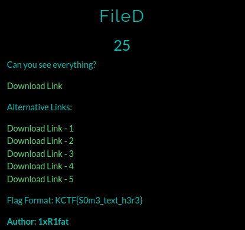
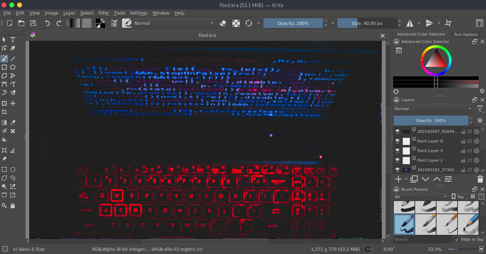
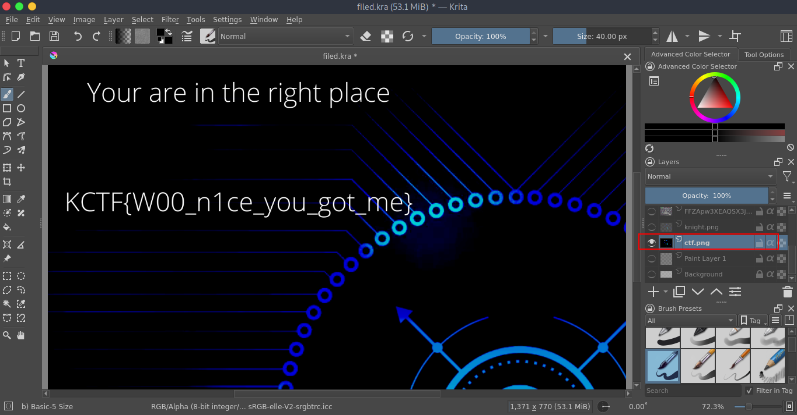

# FileD

**Category**: Steganography \
**Points**: 25

## Description

> Can you see everything?

## Solution
Given file is [filed.kra](filed.kra)

I searched about `.kra` file and I got that It's an image file created by Krita painting program.

You can download Krita from https://krita.org/en/download/krita-desktop/

Open the filed.kra file with Krita application.

In it's Camera Settings I got the model number

Hide all the layers except `ctf.png` and got the flag.

# Flag is `KCTF{W00_n1ce_you_got_me}`

