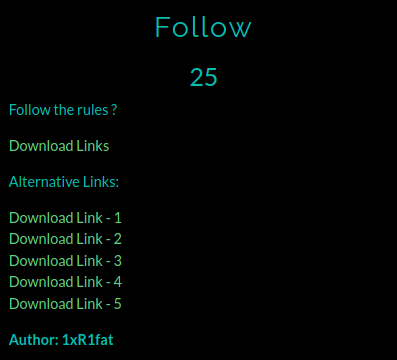
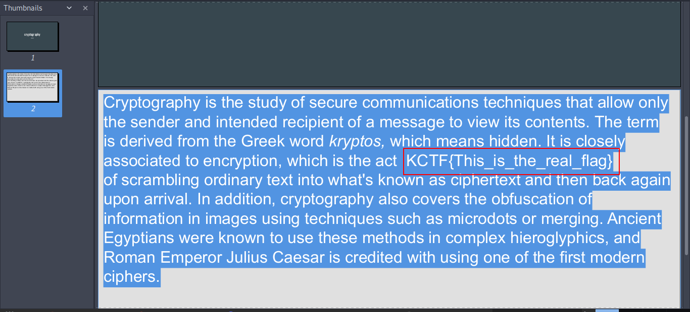

# Follow

**Category**: Steganography \
**Points**: 25

## Description

> Follow the rules ?

## Solution
Given file is [Follow.pdf](Follow.pdf)

Open the pdf and a white text hidden in the pdf

Just press Ctrl + A to reveal it

# Flag is `KCTF{This_is_the_real_flag}`

