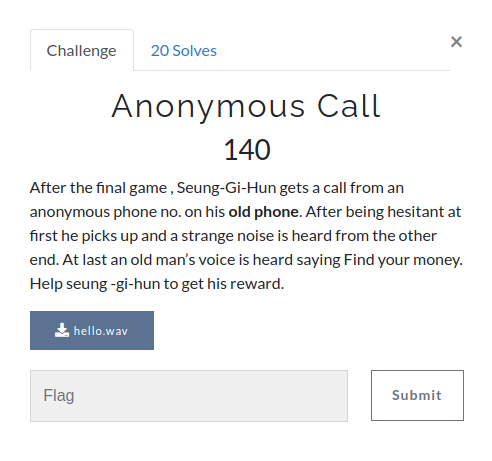

# Anonymous Call

**Category**: OSINT \
**Points**: 140

## Description

> After the final game , Seung-Gi-Hun gets a call from an anonymous phone no. on his *old phone*. After being hesitant at first he picks up and a strange noise is heard from the other end. At last an old man’s voice is heard saying Find your money. Help seung -gi-hun to get his reward.

## Solution

Given file is [hello.wav](hello.wav).

using [dtmf-decoder](https://github.com/ribt/dtmf-decoder), I got
``83678470123674877519584489584824952789553845284494878125``

decode it *from decimal to ascii* (https://onlineasciitools.com/convert-decimal-to-ascii)

(dec-to-ascii.png)

# Flag is `SCTF{C0M3_T0_TR14N_5T4T10N}`

