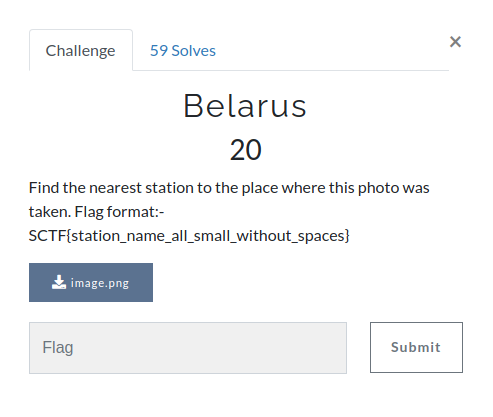
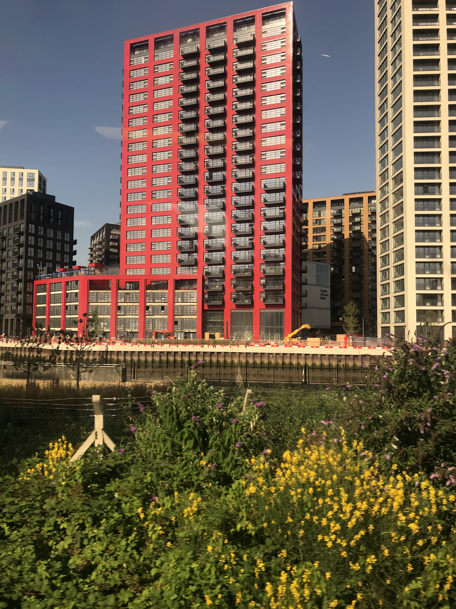
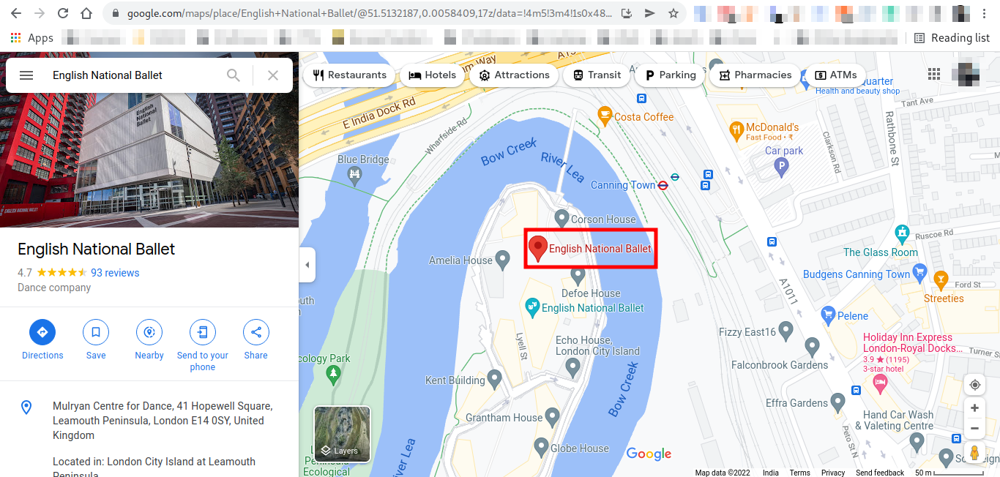
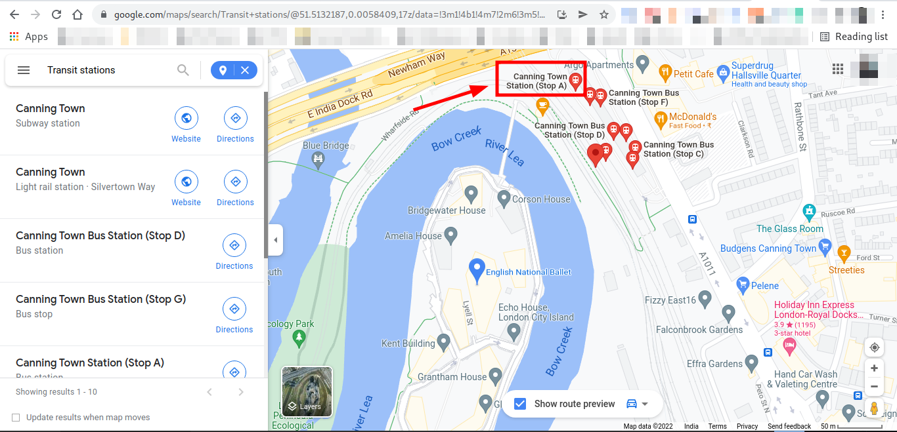

# Belarus

**Category**: OSINT \
**Points**: 20

## Description

> Find the nearest station to the place where this photo was taken:

Flag format:- SCTF{station_name_all_small_without_spaces}

## Solution

Given file is 

.

Using reverse image lookup, I got the same image with good quality
.

By looking closer, I got a name `English National Ballet`.

Searched it on google map and got this:

The google map shows that the nearest train station is "Canning Town" which is the flag.

# Flag is `SCTF{canningtown}`
 
